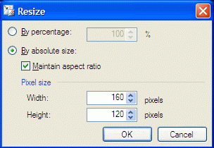
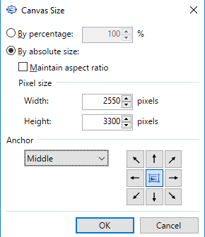

# Workflow

Here I will describe main steps and desicions that are made.

## Input 

https://picsum.photos/v2/list?page=11&limit=100 - 
- API doesn't provide any sort/order/filter inputs other than `page` and `limit`
- API always sorted by `id`
- API uses https://unsplash.com images
- API doesn't return any pagination data such as total number of pages which is sad for user experience and emhesises to use "First", "Prev", "Next" buttons instead of pagination with page numbers
- API supports `?grayscale` and `?blur=1...10` pagameters so this image manipulations could be done with api
- API seems to be quite static which means it looks like a rare case that something can change in API output, so I will save the API results in galllery to increase the speed

## Initial plan

I will use the stack of React, Redux, and MIU

The project could be split into 2 parts:

- Gallery - paginated list of images which
    - Phase 1
        - main gallery page with paginated items
        - preview will look like here https://picsum.photos/
            - `author` as link to https://unsplash.com image page. 
            - image link to image page
            - `id` link to image page
            - `download` button
        - pagination:
            - "First", "Prev", "Next" buttons,
            - "10", "25", "50", "100" select items per pages. changing page will lead user to another page so they see more or less same batch of images. selected will be stored in localStorage
            - advanced loading technique to load only missing data will be implemented
        - has image page with url/:id
        - `download` button
        - 404 page will suggest user to go to the first or last visited page
    - Phase 2
        - as API is almost static we can store all the data about images in localStorage

- Editor
    - Phase 1 (initial requirements only)
        - input fields for `height` and `width`
        - `greyscale` checkbox
        - `blug` 0-10 slider
        - `download` button to donwload current state of image
        - `reset` button to revert everything to it's current state
    - Phase 2
        - TBA

This plan (with no Phase 2) ensures rapid, high-quality implementation of key features. Even if time for better enhancements exists, the initial requirements should be implemented promptly. Future improvements and their timeline may depend on the speed of initial implementation.

Different companies has different development culture.
In my perfect world I would have been bahaved in a following way.
After preparing this plan I would have been briefly discuss this with PO. I want to meet expectations and plan as close as possibe. I would especially highlight the following 

- tech stack

- API and localStorage strategy - do I need to save as much API results in memory or even in localStorage to reduce the number of API requests? or I need to call API as frequent as possible to ensure the User has the most recent version of data from DB? let's assume we selected the strategy where we assume that data will not change during User session, but we have to refresh all local data when user reloads the whole page. only thing related to the Gallery that we need to store in localstorage is items per page

- pagination - it's not described in initial requirements
    - may be some other way of pagination (lazy loading on scroll) is required, 
    - may be pagination must always have "last" button, but API is not providing enough data this and needs to be fixed. 
    - may be number of items per page doesn't required.

    - All this details needs to be sorted out before implementation, to avoid any misunderstandings. let's assume we confirmed pagination in this way

- which url 404 page will suggest? let's assume we confirmed that last visited by user page if possible, or initial page

- download button only described for edited image, there were no reuirement to implement downloand button for initial image, so let's assume we confirmed that it's required. 

Sometimes though in some companies little changes like this are not confirmed in advance but Management rely on developers to make this choises, but even in this circumstances I believe it's better to share a plan in advance to reduce misunderstanding.

## Advanced plan

- Editor
    - Phase 2 (later)
        - input fields for `height` and `width` - replaced with
        - advanced resize instruments 
        - 
        - 
        - crop instrument so user can select the certain area from initial image
        - history of changes  so user can see and revert each change

How does the implementation of Phase 2 align with our overall project goals and priorities? Is it a critical component or a desirable enhancement?
Let's assume we have a green flag for this as well. also We agreed that we will store the history of changes in localStorage.

## Final Plan

- Gallery - paginated list of images which
    - main gallery page with paginated items
    - preview will look like here https://picsum.photos/
        - `author` as link to https://unsplash.com image page. 
        - image link to image page
        - `id` link to image page
        - `download` button
    - pagination:
        - "First", "Prev", "Next" buttons,
        - "10", "25", "50", "100" select items per pages. changing page will lead user to another page so they see more or less same batch of images. 
        - selected items per page will be stored in localStorage
    - has image page with url/:id
    - `download` button
    - 404 page will suggest user to go to the first or last visited page
    - we will store in memory fetched items to reduce the number of API requests as much as possible, but results will be refreshed if User refreshes the page

- Editor
    - `greyscale` checkbox
    - `blug` 0-10 slider
    - `download` button to donwload current state of image
    - `reset` button to revert everything to it's current state
    - advanced resize instruments 
    - 
    - 
    - crop instrument so user can select the certain area from initial image
    - history of changes so user can see and revert each change
    - history of changes is stored in localStorage